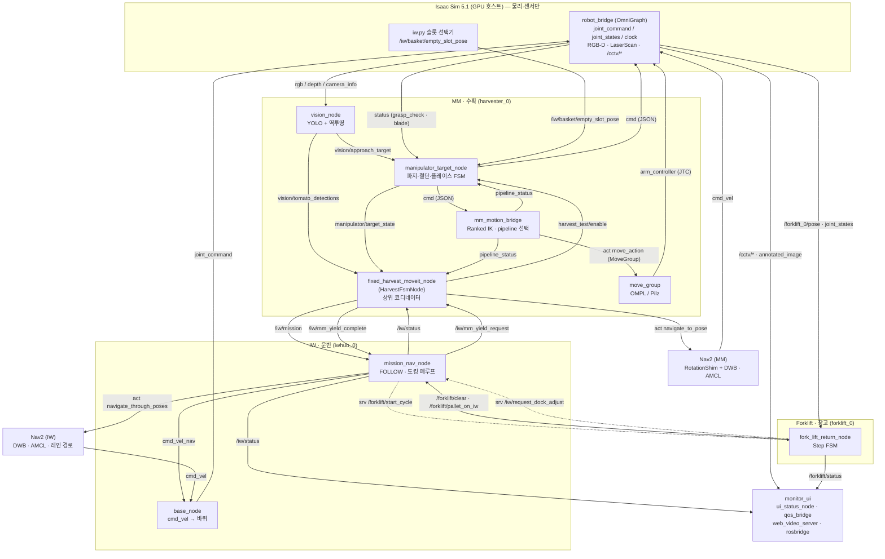
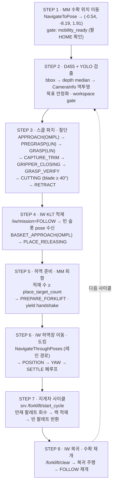
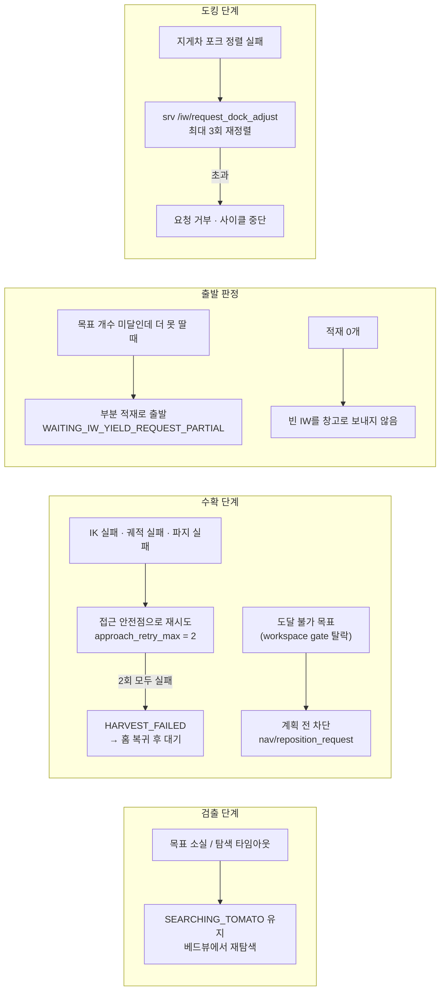
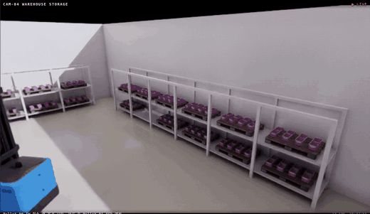

# Smart Farm Autonomous Harvest & Transport System

> ROKEY 부트캠프 협동-3 · A-2 팀 — 디지털 트윈 기반 로봇 자동화 시뮬레이션 시스템
> NVIDIA Isaac Sim 5.1 · ROS 2 · Nav2 · MoveIt 2 · YOLO · React/TypeScript


*4분할 관제 화면으로 본 한 사이클(1분 원본을 5배속으로 압축). 좌상 CAM-01 = MM 손끝 D455 + YOLO, 우상 CAM-02 = 수확 구간, 좌하 CAM-03 = 인계 구역, 우하 CAM-04 = 창고 랙.*

---

## 목차

1. [프로젝트 개요](#1-프로젝트-개요)
2. [주요 기능](#2-주요-기능)
3. [전체 시스템 구성](#3-전체-시스템-구성)
4. [시스템 아키텍처](#4-시스템-아키텍처)
5. [Functional Flow](#5-functional-flow)
6. [로봇 구성](#6-로봇-구성)
7. [핵심 알고리즘](#7-핵심-알고리즘)
8. [ROS 2 인터페이스](#8-ros-2-인터페이스)
9. [개발 및 실행 환경](#9-개발-및-실행-환경)
10. [의존성 설치](#10-의존성-설치)
11. [빌드 방법](#11-빌드-방법)
12. [실행 순서](#12-실행-순서)
13. [프로젝트 디렉터리 구조](#13-프로젝트-디렉터리-구조)
14. [시연 시나리오](#14-시연-시나리오)
15. [제한사항](#15-제한사항)
16. [팀원 및 역할](#16-팀원-및-역할)
17. [Asset Credits](#17-asset-credits)
18. [자주 겪는 문제](#18-자주-겪는-문제)

---

## 1. 프로젝트 개요

성수기에는 수확량이 단기간에 몰리지만 운반·적재 인력은 늘리기 어렵고, 반복적인 굽힘·들기
동작은 그대로 사람의 몫으로 남는다. 이 프로젝트는 **수확 → KLT 적재 → 운반 → 정밀 도킹 →
창고 랙 적재 → 빈 팔레트 반환**까지를 하나의 ROS 2 파이프라인으로 묶어, 개별 로봇 데모가
아니라 **라인 단위 폐루프**를 디지털 트윈 위에서 검증한다.

로봇 3대가 한 사이클을 나눠 맡는다.

```text
MM (수확 모바일 매니퓰레이터)  →  IW (운반 AMR)  →  Forklift (창고 지게차)
   토마토 검출·파지·절단           KLT 적재·운반·도킹      팔레트 회수·랙 적재·빈 팔레트 반환
```

설계 원칙은 **판단은 ROS 2, 실행은 Isaac Sim**이다. 모든 의사결정 FSM과 계획은 ROS 2
노드에 있고, Isaac Sim은 물리·센서·액추에이터만 담당한다. 로봇 간 협업은 코드 결합이 아니라
토픽·서비스 계약으로 분리돼 있다.

---

## 2. 주요 기능

| # | 기능 | 구현 위치 |
|---|---|---|
| 1 | YOLO 기반 토마토 검출 (원거리 `tomato` 탐지 + 근거리 `ripe`/`spoiled` 판정 — 근거리 모델은 기본 비활성) | [vision_node.py](src/smartfarm/harvest_vision/harvest_vision/vision_node.py) |
| 2 | RGB-D + `CameraInfo` 역투영으로 카메라 좌표계 3D 목표 생성, bbox 중심 영역 depth median | [vision_node.py](src/smartfarm/harvest_vision/harvest_vision/vision_node.py) |
| 3 | Doosan M0617 6축 + 3단 동축 스쿱(수용 2단 + 절단 날 1단) 수확 | [manipulator_target_node.py](src/smartfarm/harvest_vision/harvest_vision/manipulator_target_node.py) |
| 4 | MoveIt 2 — OMPL RRTConnect 원거리 접근 + Ranked IK + Pilz PTP/LIN 실행 | [mm_motion_bridge.py](src/smartfarm/mm_moveit/scripts/mm_motion_bridge.py) |
| 5 | 수용 직전 `CAPTURE_TRIM` 저속 LIN 미세 보정(velocity_scale 0.0455) | [manipulator_target_node.py:1095](src/smartfarm/harvest_vision/harvest_vision/manipulator_target_node.py#L1095) |
| 6 | MM Nav2 `NavigateToPose` 정지형 이동 + costmap 기반 피항 목표 검사 | [harvest_fsm_node.py](src/smartfarm/harvest_vision/harvest_vision/harvest_fsm_node.py) |
| 7 | IW FOLLOW · `NavigateThroughPoses` 레인 경로 · POSITION→YAW→SETTLE 정밀 도킹 | [mission_nav_node.py](src/smartfarm/iwhub_control/iwhub_control/mission_nav_node.py), [lanes.py](src/smartfarm/iwhub_control/iwhub_control/lanes.py) |
| 8 | Forklift Step FSM 기반 팔레트 회수 · 랙 적재 · 빈 팔레트 반환 (Nav2 미사용) | [fork_lift_node.py](src/smartfarm/warehouse_dock/warehouse_dock/fork_lift_node.py), [fork_lift_return_node.py](src/smartfarm/warehouse_dock/warehouse_dock/fork_lift_return_node.py) |
| 9 | Topic / Service / Action 기반 로봇 간 명시적 인계 (피항 handshake 포함) | [INTERFACES.md](src/smartfarm/INTERFACES.md) |
| 10 | React/TypeScript 4분할 관제 UI + MCAP rosbag 녹화 | [monitor_ui/](src/smartfarm/monitor_ui/) |

> **정확도 참고** — 아래 세 가지는 코드 기준으로 정정한 항목이다. 발표자료와 다르면 코드가 기준이다.
> - 비전 기본 모드는 **원거리 `tomato` 단일 클래스 탐지**다. `ripe`/`spoiled` 2클래스 근거리 판정은
>   `use_quality_model` 파라미터가 **기본 `False`**라 명시적으로 켜야 동작한다.
> - `--cctv` 고정 감시 카메라는 **4대**(`greenhouse`/`unloading`/`storage`/`overview`)다.
> - 통합 실행에서 `use_sim_ground_truth`·`direct_sim_grasp`가 **`True`**로 켜져 있다 → [15. 제한사항](#15-제한사항).

---

## 3. 전체 시스템 구성

### 3.1 계층

| 계층 | 구성 | 담당 |
|---|---|---|
| **시뮬레이션 실행 계층** | Isaac Sim 5.1 Standalone (`isaacpjt/main.py`) + OmniGraph ROS 2 브리지 | 물리(PhysX)·센서·조인트 구동. 판단하지 않음 |
| **ROS 2 판단·제어 계층** | `src/smartfarm/` ROS 2 패키지 9종 | 검출·계획·FSM·Nav2·MoveIt·로봇 간 인계 |
| **관측 계층** | `monitor_ui` (ROS 노드 + React 웹) | 영상·상태 집계, rosbag 녹화. 제어 명령을 내지 않음 |

### 3.2 패키지와 실제로 뜨는 노드

`src/smartfarm/` 아래 9개 패키지가 있고, 아래 노드들은 [12. 실행 순서](#12-실행-순서)의 launch로
실제 기동되는 것만 적었다.

| 패키지 | 노드 (executable) | 띄우는 launch | 역할 |
|---|---|---|---|
| `harvest_vision` | `vision_node` | `mm.launch.py` | YOLO 검출 → 3D 접근 목표 발행 |
| | `manipulator_target_node` | `mm.launch.py` | 파지·절단·플레이스 상세 FSM (24개 상태) |
| | `fixed_harvest_moveit_node` | `mm.launch.py` | 상위 코디네이터. `HarvestFsmNode` 상속, 고정 수확 좌표 기본값 주입 |
| | `vision_debug_view` | `mm.launch.py` (`use_debug:=true`) | 검출 오버레이·depth 디버그 창 |
| `mm_moveit` | `mm_motion_bridge.py` | `mm.launch.py` | JSON 명령 → MoveGroup goal. Ranked IK·pipeline 선택 |
| | `move_group`, `servo_node`, `ros2_control_node`, `robot_state_publisher`, `rviz2` | `mm.launch.py` | MoveIt 2 스택 (`topic_based_ros2_control`로 Isaac 연결) |
| `fleet_dispatch` | `cmd_vel_watchdog` | `mm.launch.py` | Nav2 중단 시 마지막 속도 유지 방지 |
| | `nav2_lifecycle_activator` | `mm.launch.py`, `iw.launch.py` | Nav2 lifecycle 활성화 보조 |
| `iwhub_control` | `base_node` | `iw.launch.py` | `/cmd_vel` → 좌·우 바퀴 `joint_command` 변환 |
| | `scan_self_filter_node` | `iw.launch.py` | 적재 팔레트·KLT를 자기 라이다에서 제거 |
| | `mission_nav_node` | `iw.launch.py` | IDLE/FOLLOW/PREPARE_FORKLIFT/FORKLIFT 미션 + 정밀 도킹 |
| `warehouse_dock` | `fork_lift_return_node` | `forklift.launch.py` | 팔레트 복귀·다음 팔레트 상차 순환. `ForkLiftNode` 상속 |
| `monitor_ui` | `ui_status_node`, `market_price_node`, `recorder_node`, `qos_bridge` ×5 | `ui.launch.py` | 상태 집계(5 Hz JSON)·시세·MCAP 녹화·QoS 변환 |
| `smartfarm_bringup` | (launch 전용) | — | 실행 진입점 4종 |
| `smartfarm_interfaces` | (메시지 전용) | — | `TomatoDetection(Array)`, `ForkliftCycle.srv`, `DockAdjust.srv` 등 |
| `harvest_moveit` | (레거시) | — | UR10e 시절 수확 데모. **현행 실행 경로 아님** |
| `smartfarm_common` | (빈 패키지) | — | 초기 스켈레톤. 노드 없음 |

### 3.3 로봇별 역할 분리

| 로봇 | Isaac Prim | ROS 네임스페이스 | 스폰 플래그 |
|---|---|---|---|
| MM (수확) | `/World/Harvester` | `harvester_0` | `--mm` |
| IW (운반) | `/World/IwHub` | `iwhub_0` | `--iw` |
| Forklift (창고) | `/World/Forklift` | `forklift_0` | `--fork` |

---

## 4. 시스템 아키텍처



**선 스타일 규약** — 실선 = Topic, 점선(`-.->`) = Service, 굵은 선(`==>`) = Action.

---

## 5. Functional Flow

### 5.1 정상 경로 8단계



### 5.2 예외 경로



---

## 6. 로봇 구성

| 구분 | **MM** (수확) | **IW** (운반) | **Forklift** (창고) |
|---|---|---|---|
| 네임스페이스 | `harvester_0` | `iwhub_0` | `forklift_0` |
| 구성 | Ridgeback 베이스 + Doosan **M0617** 6축 + 3단 동축 스쿱 + RealSense **D455**(eye-in-hand) | iw.hub 차동구동 AMR + 승강 데크(팔레트+KLT 적재) | ForkliftB — 후륜 구동·조향 + 승강 포크 |
| 이동 방식 | **가상 홀로노믹 x/y/yaw**(키네마틱 텔레포트) | 좌·우 차동 바퀴 (실제 PhysX 바퀴 구동) | Ackermann형 후륜 조향, wheelbase 2.05 m, 조향 ±70°, **제자리 회전 불가** |
| 경로 계획 | Nav2 자유 경로 (`NavigateToPose`) | Nav2 + 결정적 레인 그래프 (`NavigateThroughPoses`) | **Nav2 미사용** — 웨이포인트 Step FSM |
| 지역 제어기 | RotationShim → DWB | DWB (shim 없음) | 자체 Step 실행기 (전·후진 방향 잠금) |
| 위치추정 | AMCL (`OmniMotionModel`) | AMCL | Isaac `/forklift_0/pose` 직접 사용 |
| 정밀 제어 | 목표 허용오차 0.15 m / 0.35 rad | 도킹 전용 폐루프 ≤ 0.04 m · ≤ 2° · 1 s 안정 | 랙 삽입 X ±4 cm · Yaw ±3°, 데크 안착 2 mm / 0.4 s |
| 팔 제어 | MoveIt 2 (`move_group`) + `topic_based_ros2_control` | 없음 | 없음 (포크 prismatic 1축, 0 ~ 2.0 m) |
| 주요 토픽 | `/harvester_0/cmd`, `/harvester_0/joint_command`, `/harvester_0/rgb·depth·camera_info` | `/iwhub_0/cmd_vel`, `/iwhub_0/cmd_vel_nav`, `/iwhub_0/odom`, `/iwhub_0/joint_command` | `/forklift_0/joint_command`, `/forklift_0/pose` |


*CAM-01(MM 손끝 D455). YOLO 검출 오버레이와 3단 스쿱이 IW 데크의 KLT에 과실을 놓는 구간.*

---

## 7. 핵심 알고리즘

### 7.1 Vision — [`vision_node.py`](src/smartfarm/harvest_vision/harvest_vision/vision_node.py)

Ultralytics YOLO 기반 **2단계 모델** 구조다.

| 단계 | 모델 파일 | 클래스 | 기본 conf | 기본 활성 |
|---|---|---|---|---|
| 원거리 탐지 | `resource/finetuned_far.pt` | `tomato` | 0.45 | **켜짐** |
| 근거리 품질 판정 | `resource/finetuned_near.pt` | `ripe` / `spoiled` | 0.55 | **꺼짐** (`use_quality_model` 기본 `False`) |

처리 순서:

1. **2D 검출** — `finetuned_far.pt`로 프레임 내 토마토 bbox를 얻는다.
2. **Depth 처리** — bbox 중심 부분 영역의 **median depth**(`_median_depth`)를 쓴다. 단일 픽셀
   depth는 잎 가림·노이즈에 취약해 중앙값으로 대표값을 잡는다.
3. **역투영** — `CameraInfo`의 `fx, fy, cx, cy`로 픽셀 + depth를 카메라 광학 좌표계 3D 점으로 변환한다.
4. **목표 안정화** — 근거리 품질 모드가 켜졌을 때 `_stable_quality()`가 여러 프레임의 클래스
   투표를 모아 다수 라벨과 평균 confidence를 확정한다.
5. **workspace gate** — 도달 불가 목표는 `manipulator_target_node`가 계획 **전에** 차단하고,
   필요하면 `nav/reposition_request`로 베이스 재배치를 요청한다.
6. 결과는 `TomatoDetectionArray`(전체)와 `PoseStamped`(최근접 1개)로 나뉘어 발행된다.

> **시뮬레이션 GT 보조 경로** — 통합 실행 launch
> [`vision_harvest_bringup.launch.py`](src/smartfarm/mm_moveit/launch/vision_harvest_bringup.launch.py)는
> `manipulator_target_node`에 **`use_sim_ground_truth: True`, `direct_sim_grasp: True`**를 준다.
> 즉 최종 파지 좌표는 Isaac이 `/harvester_0/sim/tomato`로 내려주는 ground truth로 보정된다.
> 순수 RGB-D 인식만으로 파지까지 가는 경로는 아니다 → [15. 제한사항](#15-제한사항).

### 7.2 MoveIt 2 — [`mm_motion_bridge.py`](src/smartfarm/mm_moveit/scripts/mm_motion_bridge.py)

`move_group`에는 **3개 파이프라인(`ompl`, `pilz_industrial_motion_planner`, `chomp`)이 등록**돼
있지만, 실제 goal의 `pipeline_id`로 **요청되는 것은 `ompl`과 `pilz` 두 개뿐**이다.

| 기법 | 사용 구간 | 실사용 여부 |
|---|---|---|
| **OMPL RRTConnect** (`RRTConnectkConfigDefault`) | `APPROACH`, `BASKET_APPROACH` — 원거리 충돌 회피 접근 | **사용** |
| **Ranked IK** | 여러 seed IK 해 중 관절 변화가 작고 충돌 없는 해 선택 (`ik_max_single_joint_change_rad` = 120°) | **사용** |
| **Pilz PTP** | `HOME`, `BED_VIEW` 등 관절 목표 자세 전환 (velocity 0.52) | **사용** |
| **Pilz LIN** | `PREGRASP`, `GRASP`, `RETRACT_LIN`, `BASKET_RETRACT` — TCP 직선 접근·후퇴 (velocity 0.195) | **사용** |
| **CAPTURE_TRIM** | 수용 직전, 최신 과실 위치를 반영한 저속 LIN 보정 (velocity_scale **0.0455**) | **사용** |
| **Pilz CIRC** | 브리지에 구현돼 있으나 최종 수확 시퀀스에서 **호출되지 않음** | **미사용 (실험 기능)** |
| **MoveIt Servo** (`servo_node`) | launch로 **프로세스는 뜨지만** `delta_twist_cmds` 발행·`start_servo` 호출이 현행 경로에 없음 | **기동만, 미사용** |
| **CHOMP** | 파이프라인 등록만 돼 있고 `pipeline_id="chomp"` 요청이 없음 | **미사용 (로드만)** |

> **CIRC 근거** — 상태 이름 `RETRACT_CIRC`는 남아 있지만 실제 motion은 LIN이다.
> [`manipulator_target_node.py:987-990`](src/smartfarm/harvest_vision/harvest_vision/manipulator_target_node.py#L987)에
> `# 축방향 직선 삽입/후퇴 — CIRC 원호를 쓰지 않는다`와 `motion = "LIN"`이,
> [같은 파일 763줄](src/smartfarm/harvest_vision/harvest_vision/manipulator_target_node.py#L763)에
> `interim = 0.5 * (pregrasp + grasp)  # CIRC 미사용, 필드 자리채움`이 명시돼 있다.
>
> **Servo 근거** — `servo_node`는 [`m0617_moveit_bringup.launch.py:263`](src/smartfarm/mm_moveit/launch/m0617_moveit_bringup.launch.py#L263)에서
> 기동되지만, `servo_node/delta_twist_cmds`·`start_servo`를 실제로 쓰는 코드는 레거시 프로토타입
> [`harvest_moveit/scripts/grasp_proto.py`](src/smartfarm/harvest_moveit/scripts/grasp_proto.py)뿐이고 현행 실행 경로에 없다.

**수확 모션 시퀀스** (`ACTIVE_SEQUENCE_STATES`, 24개 상태 중 주 경로):

```text
APPROACH(OMPL) → PREGRASP(LIN) → GRASP(LIN) → CAPTURE_TRIM(LIN 저속)
  → GRIPPER_CLOSING → GRASP_VERIFY → CUTTING(blade 40°↑) → CUT_VERIFY
  → BLADE_OPENING → RETRACT_CIRC(LIN) → RETRACT_LIN(LIN)
  → PRE_PLACE → BASKET_AZIMUTH_ALIGN → BASKET_APPROACH(OMPL)
  → PLACE_RELEASING → BASKET_RETRACT(LIN) → POST_PLACE_BED_VIEW → GO_HOME
```

### 7.3 Nav2

#### MM — [`moveit_nav2.yaml`](src/smartfarm/fleet_dispatch/config/moveit_nav2.yaml)

| 항목 | 값 |
|---|---|
| Action | `navigate_to_pose` (`NavigateToPose`) |
| Controller | `nav2_rotation_shim_controller::RotationShimController` → primary `dwb_core::DWBLocalPlanner` |
| Planner | `nav2_navfn_planner/NavfnPlanner` |
| Localization | AMCL, `nav2_amcl::OmniMotionModel` |
| Goal tolerance | `xy 0.15 m` · `yaw 0.35 rad` |
| Footprint | `[[0.48, 0.40], [0.48, -0.40], [-0.48, -0.40], [-0.48, 0.40]]` (원형 근사 시 통로 여유 부족) |
| Inflation radius | 0.70 m (내접반경 0.41 m ≤ r < 통로 반폭 0.75 m) |
| 속도 | `max_vel_x 1.2` / `min_vel_x -0.3` (후진 제한으로 목표 주변 왕복 억제) |
| 인터록 | `mobility_ready` — 팔이 HOME이어야 베이스 이동 허용 |

#### IW — [`nav2_params.yaml`](src/smartfarm/iwhub_control/config/nav2_params.yaml) + [`lanes.py`](src/smartfarm/iwhub_control/iwhub_control/lanes.py)

| 항목 | 값 |
|---|---|
| Action | `navigate_through_poses` (`NavigateThroughPoses`) |
| Controller | `dwb_core::DWBLocalPlanner` (**RotationShim 없음**) |
| Goal tolerance | `xy 0.25 m` · `yaw 0.25 rad` |
| Footprint | local `[[0.60, 0.401] … [-0.9835, -0.401]]` + padding 0.05 / global `[[0.65, 0.451] … ]` |
| Inflation radius | 0.55 m |
| 속도 | `max_vel_x 1.00` · `min_vel_x 0.0` (긴 후방 오버행 때문에 임의 후진 금지) |
| 레인 그래프 | 세로 `X = (-6.0, -2.9, 0.0, 2.9, 6.0)` / 가로 `Y = (-11.5, -3.85, 3.85, 11.5)` — 통로 중심선만 통과 |
| MM 추종 | `dock_standoff` 1.03 m 이격, **갱신 deadband** `follow_update_distance 0.30 m` 또는 `follow_update_yaw 30°` |
| 도크 좌표 | `(0.0, 10.84885, yaw = π)` |

**정밀 도킹 폐루프** (`mission_nav_node`, 20 Hz 타이머):

```text
APPROACH ─(capture_radius 0.55 m 안)→ ALIGNING
   stage POSITION  : 위치 오차 ≤ 0.04 m 까지 저속 병진 (max 0.08 m/s)
   stage YAW       : 각도 오차 ≤ 2° 까지 제자리 회전 (max 0.60 rad/s)
   stage SETTLE    : 1.0 s 안정 유지 → 도킹 완료
   timeout 45 s / 재정렬 요청 최대 3회
```

#### Forklift — **Nav2 미사용**

경로가 고정된 창고 내부라 장애물 회피보다 팔레트 교환 순서와 정밀 자세가 중요하다.
[`fork_lift_node.py`](src/smartfarm/warehouse_dock/warehouse_dock/fork_lift_node.py)의 Step FSM이
웨이포인트를 순차 실행한다.

| 제어 | 값 |
|---|---|
| 랙 구성 | 3 섹터 × 2 단 = **6 슬롯** (`RACK_CENTER_X` 6개, base Z `0.322` / `1.222`) |
| 포크 승강 | 0 ~ 2.0 m, 적재 시 0.15 m/s / 빈 포크 0.45 m/s |
| 주행 방향 잠금 | 한 Step에서 전진/후진을 최초 1회만 선택 (목표선 채터링 방지) |
| 랙 삽입 허용오차 | X ±4 cm · Yaw ±3° · 조향 0° |
| 데크 안착 | 2 mm 오차 0.4 s 유지 후 FixedJoint 전환 |



*CAM-04(창고 고정 카메라). 지게차가 IW에서 회수한 팔레트를 랙 슬롯에 넣는 구간.*

---

## 8. ROS 2 인터페이스

`smartfarm_interfaces` 커스텀 타입과 표준 타입이 섞여 있다. 전체 계약과 폐기 이력은
[`src/smartfarm/INTERFACES.md`](src/smartfarm/INTERFACES.md)에 있다.

### 8.1 로봇 간 인계 — Topic

| Topic | Type | Publisher | Subscriber | 목적 |
|---|---|---|---|---|
| `/iw/mission` | `std_msgs/String` (latched) | `fixed_harvest_moveit_node` | `mission_nav_node` | `IDLE` / `FOLLOW` / `PREPARE_FORKLIFT` / `FORKLIFT` |
| `/iw/status` | `std_msgs/String` (latched) | `mission_nav_node` | `fixed_harvest_moveit_node`, `ui_status_node` | IW 미션·도킹 상태 |
| `/iw/mm_yield_request` | `std_msgs/Bool` (latched) | `mission_nav_node` | `fixed_harvest_moveit_node` | IW 출발 전 MM 피항 요청 |
| `/iw/mm_yield_complete` | `std_msgs/Bool` (latched) | `fixed_harvest_moveit_node` | `mission_nav_node` | MM 피항 완료 통지 |
| `/iw/basket/empty_slot_pose` | `geometry_msgs/PoseStamped` | **Isaac** ([`isaacpjt/iw.py`](isaacpjt/iw.py)) | `manipulator_target_node`, `fixed_harvest_moveit_node` | IW 데크의 다음 빈 KLT 슬롯 pose |
| `/iw/resume_harvest` | `std_msgs/Bool` (latched) | `mission_nav_node` | *(현재 ROS 구독자 없음 — 상태 통지용)* | IW 복귀 완료 |
| `/forklift/amr_docked` | `std_msgs/Bool` (latched) | `mission_nav_node`, `fixed_harvest_moveit_node` | `fork_lift_node` | IW 도킹 완료 → 하역 트리거 |
| `/forklift/clear` | `std_msgs/Bool` | `fork_lift_node` | `mission_nav_node` | 지게차 작업 완료 → IW 출발 허가 |
| `/forklift/pallet_on_iw` | `std_msgs/Int32` | `fork_lift_node` | `mission_nav_node`, `fork_lift_return_node` | IW에 올린 팔레트 번호 |
| `/forklift/status` | `std_msgs/String` | `fork_lift_node` | `ui_status_node` | 지게차 Step 상태 |
| `/forklift_0/pose` | `geometry_msgs/PoseStamped` | Isaac | `fork_lift_node`, `ui_status_node` | 지게차 map pose |

### 8.2 로봇 간 인계 — Service

| Service | Type | Client | Server | 목적 |
|---|---|---|---|---|
| `/forklift/start_cycle` | `smartfarm_interfaces/ForkliftCycle` | `mission_nav_node` | `fork_lift_return_node` | 팔레트 교환 사이클 접수. 요청에 IW 실측 `dock_x/y/yaw` 포함, 응답은 접수 여부 + `outbound_pallet` |
| `/iw/request_dock_adjust` | `smartfarm_interfaces/DockAdjust` | `fork_lift_return_node` | `mission_nav_node` | 포크 정렬 실패 시 IW 재정렬 요청 (최대 3회) |
| `/recording/start` · `/recording/stop` | `std_srvs/Trigger` | 웹 UI (rosbridge) | `recorder_node` | MCAP rosbag 녹화 제어 |

### 8.3 Action

| Action | Type | Client | Server | 목적 |
|---|---|---|---|---|
| `/harvester_0/navigate_to_pose` | `nav2_msgs/NavigateToPose` | `fixed_harvest_moveit_node` | Nav2 (MM) | 수확 위치·피항 위치 이동 |
| `/iwhub_0/navigate_through_poses` | `nav2_msgs/NavigateThroughPoses` | `mission_nav_node` | Nav2 (IW) | 레인 웨이포인트 경로 주행 |
| `/harvester_0/move_action` | `moveit_msgs/MoveGroup` | `mm_motion_bridge` | `move_group` | 팔 모션 계획·실행 |

### 8.4 MM 내부 파이프라인 — Topic

| Topic (`harvester_0` 네임스페이스) | Type | Publisher | Subscriber |
|---|---|---|---|
| `vision/tomato_detections` | `smartfarm_interfaces/TomatoDetectionArray` | `vision_node` | `ui_status_node` |
| `vision/approach_target` | `geometry_msgs/PoseStamped` | `vision_node` | `manipulator_target_node` |
| `vision/target_class` | `std_msgs/String` | `vision_node` | `manipulator_target_node` |
| `vision/annotated_image` | `sensor_msgs/Image` | `vision_node` | `vision_debug_view`, `qos_bridge` (CAM-01) |
| `manipulator/target_state` | `std_msgs/String` (latched) | `manipulator_target_node` | `fixed_harvest_moveit_node`, `ui_status_node` |
| `manipulator/mobility_ready` | `std_msgs/Bool` (latched) | `manipulator_target_node` | `fixed_harvest_moveit_node` |
| `pipeline_status` | `std_msgs/String` | `mm_motion_bridge` | `manipulator_target_node`, `fixed_harvest_moveit_node` |
| `moveit_ready` | `std_msgs/Bool` (latched) | `mm_motion_bridge` | `fixed_harvest_moveit_node` |
| `harvest_test/enable` | `std_msgs/Bool` (latched) | `fixed_harvest_moveit_node` | `manipulator_target_node` |
| `cmd` | `std_msgs/String` (JSON) | `manipulator_target_node`, `fixed_harvest_moveit_node` | **Isaac** — 그리퍼/블레이드/베이스 |
| `status` | `std_msgs/String` | **Isaac** | `manipulator_target_node` — grasp_check / blade 응답 |
| `sim/tomato` | `std_msgs/String` | **Isaac** | `manipulator_target_node` — GT 보조 (§15) |

> `rmpflow_status_topic`·`rmp_status_topic` 파라미터는 둘 다 문자열 `"pipeline_status"`로 설정돼
> 있다. `mm_motion_bridge.py` 소스에 이 이름이 하드코딩돼 있어 **바꾸면 phase 전이가 깨진다**
> (2026-07-27 확인). Isaac의 grasp_check/blade 응답은 별도 파라미터 `isaac_status_topic`(=`status`)이 받는다.

### 8.5 Isaac 브리지 · 관제 — Topic

| Topic | Type | 방향 | 비고 |
|---|---|---|---|
| `/{ns}/joint_command` | `sensor_msgs/JointState` | ROS → Isaac | `ns` = `harvester_0` / `iwhub_0` / `forklift_0` |
| `/{ns}/joint_states` | `sensor_msgs/JointState` | Isaac → ROS | |
| `/clock` | `rosgraph_msgs/Clock` | Isaac → ROS | `use_sim_time: true` 전제 |
| `/harvester_0/rgb` · `depth` · `camera_info` | `sensor_msgs/Image`, `CameraInfo` | Isaac → ROS | 손끝 D455 (기본 켜짐, `--no-camera`로 끔) |
| `/cctv/greenhouse` · `unloading` · `storage` · `overview` | `sensor_msgs/Image` | Isaac → ROS | `--cctv` 필요. **4대** |
| `/iwhub_0/cmd_vel` · `/iwhub_0/cmd_vel_nav` | `geometry_msgs/Twist` | Nav2·도킹 → `base_node` | |
| `/iwhub_0/odom` | `nav_msgs/Odometry` | Isaac → ROS | |
| `/ui/{pane}/compressed` | `sensor_msgs/CompressedImage` | `image_transport republish` → 브라우저 | pane = `mm_front`/`greenhouse`/`unloading`/`storage`/`overview` |
| `/ui/status` | `std_msgs/String` (JSON, 5 Hz) | `ui_status_node` → rosbridge | 카메라 Hz·로봇 pose·수확 카운트·시세 |
| `/market/summary` | `std_msgs/String` (latched) | `market_price_node` | 공공데이터 토마토 시세 (인증키 없으면 `unavailable`) |
| `/recording/status` | `std_msgs/String` | `recorder_node` | MCAP 녹화 상태 |

---

## 9. 개발 및 실행 환경

| 항목 | 값 | 확인 위치 |
|---|---|---|
| OS | **Ubuntu 22.04 LTS** | — |
| 시뮬레이터 | **NVIDIA Isaac Sim 5.1** (Standalone, PhysX) | `isaacpjt/main.py` |
| Isaac 파이썬 | **Isaac 동봉 `python.sh` (Python 3.11) 전용** — 시스템 python 사용 불가 | `~/dev_ws/isaac_sim/isaacsim/_build/linux-x86_64/release/python.sh` |
| ROS 2 (기준) | **Humble** — Isaac 브리지가 domain 108 / Humble 고정 | `main.py` `_bootstrap_isaac_ros2()` |
| ROS 2 (호환) | **Jazzy** — launch가 `_DISTRO` 분기로 Humble/Jazzy 키 차이를 흡수 | `m0617_moveit_bringup.launch.py:268`, `moveit_nav2.yaml:82-83` |
| `ROS_DOMAIN_ID` | **108** — `main.py`가 강제 설정 (`~/.bashrc`가 109를 내보내도 덮어씀) | `main.py:107` |
| RMW | **`rmw_fastrtps_cpp`** | `main.py:108` |
| `ROS_LOCALHOST_ONLY` | `0` | `main.py:109` |
| `use_sim_time` | **`true`** (전 launch 기본값) | 모든 `*.launch.py` |
| 지도 | `~/cobot3_ws/maps/farm.yaml` (생성본 `farm_gen.yaml`) | `mm.launch.py:14`, `iw.launch.py:16` |
| GPU | Isaac Sim 5.1 요구사항 기준 RTX 계열 필요. RTX 50 계열은 PyTorch **cu128 이상** 빌드 | — |

> **Humble ↔ Jazzy 혼용 주의** — Humble 내장 Fast-DDS(2.6.10)와 Jazzy Fast-DDS(2.14.x)를 같은
> domain에 직접 물리면 `ros_discovery_info` CDR 해석 실패로 abort가 발생한다(2026-07-27 확인).
> 워크스테이션이 Jazzy라면 `docker/domain_bridge/`로 108 ↔ 109를 중계한다.
> `ISAACPJT_ROS_DISTRO=jazzy`는 **미검증 실험 경로**다.

---

## 10. 의존성 설치

### 10.1 apt — ROS 2 패키지

`ros-*-desktop`만으로는 **부족하다**. 빠뜨리면 launch가 `package '...' not found`로 즉사한다.

```bash
source /opt/ros/humble/setup.bash
sudo apt update

# MoveIt 2 / ros2_control / 주행
sudo apt install -y \
  ros-$ROS_DISTRO-moveit \
  ros-$ROS_DISTRO-moveit-servo \
  ros-$ROS_DISTRO-moveit-planners-chomp \
  ros-$ROS_DISTRO-moveit-task-constructor-core \
  ros-$ROS_DISTRO-moveit-task-constructor-capabilities \
  ros-$ROS_DISTRO-ros2-control \
  ros-$ROS_DISTRO-ros2-controllers \
  ros-$ROS_DISTRO-ur-description \
  ros-$ROS_DISTRO-ur-moveit-config \
  ros-$ROS_DISTRO-navigation2 \
  ros-$ROS_DISTRO-nav2-bringup \
  ros-$ROS_DISTRO-nav2-smac-planner \
  ros-$ROS_DISTRO-nav2-regulated-pure-pursuit-controller \
  ros-$ROS_DISTRO-slam-toolbox

# Isaac ↔ MoveIt 하드웨어 인터페이스
sudo apt install -y ros-$ROS_DISTRO-topic-based-ros2-control

# 관제 UI 전용 (UI를 안 쓰면 생략 가능)
sudo apt install -y \
  ros-$ROS_DISTRO-web-video-server \
  ros-$ROS_DISTRO-compressed-image-transport \
  ros-$ROS_DISTRO-image-transport \
  ros-$ROS_DISTRO-rosbridge-server \
  ros-$ROS_DISTRO-rosbag2-storage-mcap
```

목록을 외우는 대신 `package.xml`에서 뽑아 쓰는 쪽이 안전하다.

```bash
cd ~/cobot3_ws
rosdep install --from-paths src --ignore-src -r -y --rosdistro $ROS_DISTRO
rosdep check --from-paths src --ignore-src --rosdistro $ROS_DISTRO
# 기대 출력: "All system dependencies have been satisfied"
```

> `ROS_DISTRO`가 비어 있으면 rosdep이 키를 하나도 못 풀고 조용히 넘어간다.
> `source /opt/ros/<distro>/setup.bash`를 먼저 하거나 `--rosdistro`를 명시할 것.

### 10.2 Python

> **이 저장소에는 아직 `requirements.txt`가 없다.** 아래는 `package.xml`의 `python3-*` 의존과
> 소스 import를 실제로 조사해 정리한 목록이다. 제출 전 이 내용으로 `requirements.txt`를
> 만들어 두는 것을 권장한다.

| 패키지 | 버전 제약 | 필요한 이유 |
|---|---|---|
| `ultralytics` | — | `vision_node`의 YOLO 추론 |
| `torch` | GPU CUDA 빌드 (RTX 50 계열은 **cu128 이상**) | YOLO 백엔드 |
| `numpy` | **`<2`** | `cv_bridge`·Isaac 확장 모듈이 1.x ABI로 빌드돼 있어 2.x면 import가 깨짐 |
| `opencv-python` | — | 이미지 처리 (`python3-opencv`) |
| `pyyaml` | — | launch·config 로딩 (`python3-yaml`) |
| `pytest` | — | `isaacpjt/tests`, 패키지 테스트 (`python3-pytest`) |

```bash
pip install ultralytics "numpy<2"
# torch는 GPU에 맞는 CUDA 빌드를 별도 설치
```

ROS 쪽 rosdep 키(`python3-numpy`, `python3-opencv`, `python3-yaml`, `python3-pytest`)는
`rosdep install`이 apt로 함께 설치한다.

### 10.3 Node — 관제 UI 웹

```bash
cd ~/cobot3_ws/src/smartfarm/monitor_ui/web && npm install
```

Node 18 이상 (vite 6). [`package.json`](src/smartfarm/monitor_ui/web/package.json) 기준:

| 구분 | 패키지 |
|---|---|
| dependencies | `react ^18.3.1`, `react-dom ^18.3.1`, `roslib ^1.4.1` |
| devDependencies | `vite ^6.0.3`, `@vitejs/plugin-react ^4.3.4`, `typescript ^5.6.3`, `@types/react`, `@types/react-dom` |

`npm install`을 건너뛰면 `npm run dev`가 `> vite`만 찍고 멈춘 것처럼 보인다.
설치 중 뜨는 `npm warn allow-scripts esbuild` 경고는 무시해도 된다(프리빌트 바이너리).

### 10.4 서브모듈

```bash
git submodule update --init --recursive
```

`src/m-explore-ros2`는 [`robo-friends/m-explore-ros2`](https://github.com/robo-friends/m-explore-ros2)
커밋 `326cf8a`를 고정한 외부 패키지다(`explore_lite`, `map_merge`, `explore_lite_msgs`).
현재는 `harvester_nav2.launch.py`의 `slam:=true explore:=true` 경로에서만 쓰이고,
평상시 정적맵 + AMCL 주행에는 실행되지 않는다. 일반 `git pull`은 서브모듈 내부 커밋을
자동으로 바꾸지 않으므로 위 명령을 다시 실행해야 팀이 검증한 gitlink가 재현된다.

---

## 11. 빌드 방법

```bash
cd ~/cobot3_ws

# 1) 이전 산출물 정리 (제출용 zip 압축 전에도 동일)
rm -rf build install log

# 2) 환경 준비
source /opt/ros/humble/setup.bash

# 3) 시스템 의존성
rosdep install --from-paths src --ignore-src -r -y --rosdistro $ROS_DISTRO

# 4) 빌드
colcon build --symlink-install

# 5) 오버레이 source — 새 터미널마다 필요
source install/setup.bash
```

ROS 터미널의 환경변수는 Isaac과 반드시 같아야 한다.

```bash
export ROS_DOMAIN_ID=108
export RMW_IMPLEMENTATION=rmw_fastrtps_cpp
```

> `colcon build`가 `smartfarm_interfaces`에서 `ModuleNotFoundError: No module named 'em'` 또는
> `'catkin_pkg'`로 실패하면 [`scripts/fix_ros_build_env.sh`](scripts/fix_ros_build_env.sh)를 실행한다
> (`$ROS_DISTRO`를 감지해 맞는 `empy` 버전을 설치 — Humble/Iron 3.3.4, Jazzy 이상 4.x).
> 수동으로 `pip install empy`만 하면 안 된다.

---

## 12. 실행 순서

터미널 **6개**를 쓴다. Isaac Sim이 먼저 떠 있어야 나머지가 붙는다.
**모든 ROS 터미널은 `source install/setup.bash` + `ROS_DOMAIN_ID=108`이 되어 있어야 한다.**

```bash
# 모든 ROS 터미널 공통 준비
cd ~/cobot3_ws
source /opt/ros/humble/setup.bash
source install/setup.bash
export ROS_DOMAIN_ID=108
export RMW_IMPLEMENTATION=rmw_fastrtps_cpp
```

### 터미널 1 — Isaac Sim (물리 월드 + ROS 브리지)

```bash
cd ~/cobot3_ws/isaacpjt
isaac_python main.py --mm --iw --fork --nav --cctv
```

- **실행 위치**: `~/cobot3_ws/isaacpjt` (상대 경로 자산을 읽으므로 반드시 이 디렉터리)
- **`isaac_python`**: `~/.bashrc`의 alias → `~/dev_ws/isaac_sim/isaacsim/_build/linux-x86_64/release/python.sh`
- **source**: 불필요. `main.py`가 Isaac 내장 ROS 2 라이브러리 환경으로 스스로 재실행한다
- **환경변수**: `main.py`가 `ROS_DOMAIN_ID=108`, `RMW_IMPLEMENTATION=rmw_fastrtps_cpp`,
  `ROS_LOCALHOST_ONLY=0`을 **강제 설정**한다 (셸 값보다 우선)
- **정상 확인**:
  ```bash
  ros2 topic echo /clock --once
  ros2 topic list | grep -E "harvester_0|iwhub_0|forklift_0|cctv"
  ```

| 플래그 | 의미 |
|---|---|
| `--mm` / `--iw` / `--fork` | 각 로봇 스폰 (조합 가능, 없으면 씬만) |
| `--nav` | Nav2용 `cmd_vel`·`odom`·`scan` 브리지 일괄. 개별은 `--nav-drive`/`--nav-odom`/`--nav-scan` |
| `--cctv` | 관제 UI용 **고정 감시 카메라 4대**. 카메라마다 씬을 다시 렌더해서 기본은 꺼짐 |
| `--no-camera` | 손끝 D455를 끈다 (**기본은 켜짐**). `--camera`는 인식되지 않는 인자로, 붙여도 무해해 관례로 남아 있음 |
| `--headless` / `--no-ros` / `--quiet` | GUI 없이 / ROS 브리지 없이 / 로그 스팸 억제 |
| `--mm-teleop` | MM 키보드 텔레옵 (`--mm` 필수, `--nav`와 동시 사용 불가) |
| `--export [path]` / `--load` | 조립한 씬을 USD로 저장(기본 `~/cobot3_ws/scene.usd`) / 기존 USD에서 로드 |

> launch로 감싼 형태도 있다 — `ros2 launch smartfarm_bringup isaac_sim.launch.py`.
> 다만 이쪽은 인자가 `--mm --iw --fork --nav --camera`로 **고정**되어 `--cctv`가 빠지므로,
> 관제 UI를 쓸 때는 위 직접 실행을 쓴다.

### 터미널 2 — MM (Nav2 + MoveIt + 비전 + 수확 FSM)

```bash
ros2 launch smartfarm_bringup mm.launch.py
```

- **실행 위치**: 아무 곳 (`~/cobot3_ws` 권장)
- **주요 인자** (기본값):

| 인자 | 기본값 | 의미 |
|---|---|---|
| `harvest_x` / `harvest_y` / `harvest_yaw` | `-0.54` / `-8.19` / `1.91` | MM이 정차해 수확할 map 자세 |
| `initial_pose_x` / `initial_pose_y` / `initial_pose_yaw` | `0.0` / `-12.0` / `0.0` | AMCL 초기 pose |
| `place_target_count` | `1` | **IW 하역 전 수확·적재할 토마토 개수** |
| `map` | `~/cobot3_ws/maps/farm.yaml` | 정적 지도 |
| `nav_rviz` / `moveit_rviz` / `use_debug` | `true` | RViz 2종·비전 디버그 창 |
| `use_sim_time` | `true` | |

  ```bash
  # 2회 수확 후 하역 (IW 데크 앞열 빈 KLT가 2칸이라 최대 2까지 의미가 있다)
  ros2 launch smartfarm_bringup mm.launch.py place_target_count:=2
  ```

- **정상 확인**:
  ```bash
  ros2 topic echo /harvester_0/moveit_ready --once          # data: true
  ros2 topic echo /harvest_test/status --once               # READY_FOR_NAV_GOAL → NAVIGATING…
  ros2 topic hz   /harvester_0/vision/tomato_detections
  ```

### 터미널 3 — IW (운반 AMR)

```bash
ros2 launch smartfarm_bringup iw.launch.py
```

| 인자 | 기본값 | 의미 |
|---|---|---|
| `iw_dock_standoff` | `1.03` | MM 중심에서 IW 추종 정차점까지 이격 거리 (m) |
| `iw_rviz` | `true` | IW 전용 RViz |
| `map` | `~/cobot3_ws/maps/farm.yaml` | |
| `use_sim_time` | `true` | |

- **정상 확인**:
  ```bash
  ros2 topic echo /iw/status --once          # IDLE
  ros2 action list | grep navigate_through_poses
  ros2 topic hz /iwhub_0/odom
  ```

### 터미널 4 — Forklift (창고 하역)

```bash
ros2 launch smartfarm_bringup forklift.launch.py
```

| 인자 | 기본값 | 의미 |
|---|---|---|
| `use_sim_time` | `true` | |

  노드 파라미터 `initial_pallet`은 launch에서 `0`으로 고정된다.

- **정상 확인**:
  ```bash
  ros2 service list | grep /forklift/start_cycle
  ros2 topic echo /forklift/status --once
  ```

### 터미널 5 — 관제 UI (ROS 쪽)

```bash
ros2 launch monitor_ui ui.launch.py
```

영상 스트리밍(`web_video_server` :8080) + `rosbridge` (:9090) + 상태 집계 + 시세 + 녹화 제어가
한 번에 뜬다. **Isaac을 `--cctv`와 함께 띄워야** 고정 카메라 4대가 나온다.

- **정상 확인**:
  ```bash
  ros2 topic hz /ui/status                        # ≈5 Hz
  curl -s -o /dev/null -w "%{http_code}\n" http://localhost:8080/   # 200
  ```

> `ui.launch.py`가 `stream.launch.py`를 포함한다. 둘을 같이 띄우면 영상 노드가 이중으로 뜬다.
> 영상 배선만 따로 볼 때에만 `stream.launch.py`를 단독으로 쓴다.
>
> 시세 패널은 공공데이터 인증키가 있어야 값이 나온다.
> `export DATA_GO_KR_SERVICE_KEY=<발급키>` 후 launch하면 되고, 없으면 `unavailable`만 발행된다
> (브라우저에는 키를 노출하지 않는다).

### 터미널 6 — 관제 UI (웹 화면)

```bash
cd ~/cobot3_ws/src/smartfarm/monitor_ui/web
npm run dev        # 최초 1회는 npm install
```

브라우저에서 <http://localhost:5173>.

| 키 | 동작 |
|---|---|
| `1` ~ `4` | 해당 카메라 확대 (더블클릭 동일) |
| `5` | 전체 조감도 CAM-05 (orthographic) |
| `0` / `ESC` | 2×2 복귀 |
| `R` | rosbag 녹화 시작·정지 (MCAP) |
| `H` / `D` | HUD 숨김 / 디버그(수신 Hz·로봇 좌표) |

| 패널 | 소스 토픽 |
|---|---|
| CAM-01 MM D455 / YOLO | `/harvester_0/vision/annotated_image` |
| CAM-02 HARVESTING OPERATION | `/cctv/greenhouse` |
| CAM-03 UNLOADING AREA | `/cctv/unloading` |
| CAM-04 WAREHOUSE STORAGE | `/cctv/storage` |
| CAM-05 OVERVIEW (격자 밖) | `/cctv/overview` |


---

## 13. 프로젝트 디렉터리 구조

```text
~/cobot3_ws/
├── isaacpjt/                       # Isaac Sim 씬·로봇·ROS 브리지 (Isaac python 전용)
│   ├── main.py                     #   시뮬레이션 진입점 — 플래그로 로봇 선택
│   ├── mm.py  iw.py  fork.py       #   로봇별 드라이버 (수확 MM / 운반 AMR / 지게차)
│   ├── robots/                     #   URDF·USD 임포트, 스쿱·커터 지그, 제어
│   ├── scene/                      #   greenhouse · warehouse · tomato_plants · monitor_cams
│   ├── ros/robot_bridge.py         #   OmniGraph ROS 2 브리지 빌더
│   ├── pjt_config/settings.py      #   씬·로봇 설정 단일 출처 (섹터·랙·과실·그리퍼)
│   ├── tools/  spikes/             #   probe 스크립트, 기술 검증 스파이크
│   └── tests/                      #   시뮬 로직 pytest
├── src/
│   ├── smartfarm/                  # 프로젝트 ROS 2 패키지
│   │   ├── smartfarm_bringup/      #   실행 진입점 launch 4종
│   │   ├── harvest_vision/         #   vision_node · manipulator_target_node · harvest_fsm_node
│   │   │   ├── resource/*.pt       #     YOLO 가중치 (finetuned_far / finetuned_near)
│   │   │   ├── config/             #     manipulator_target.yaml (스쿱 기하·파지 파라미터)
│   │   │   └── launch/
│   │   ├── mm_moveit/              #   MM MoveIt 2 — URDF/SRDF, OMPL·Pilz·CHOMP config, mm_motion_bridge
│   │   ├── iwhub_control/          #   base_node · mission_nav_node · lanes.py · Nav2 params
│   │   ├── warehouse_dock/         #   fork_lift_node · fork_lift_return_node (Step FSM)
│   │   ├── fleet_dispatch/         #   Nav2 bringup·AMCL config, cmd_vel_watchdog, lifecycle activator
│   │   ├── monitor_ui/             #   관제 UI
│   │   │   ├── monitor_ui/         #     ui_status_node · qos_bridge · recorder_node · market_price_node
│   │   │   ├── launch/             #     ui.launch.py · stream.launch.py
│   │   │   └── web/                #     React + Vite + TypeScript 클라이언트
│   │   ├── smartfarm_interfaces/   #   커스텀 msg 6종 · srv 2종
│   │   ├── harvest_moveit/         #   레거시(UR10e 시절) — 현행 실행 경로 아님
│   │   ├── smartfarm_common/       #   빈 스켈레톤
│   │   └── INTERFACES.md           #   전 트랙 토픽·서비스 계약과 폐기 이력
│   ├── m0609/                      # 부트캠프 실습 (개인 폴더)
│   ├── m-explore-ros2/             # 외부 서브모듈 — frontier 자동 탐사·맵 병합
│   ├── topic_based_ros2_control/   # vendored — MoveIt ↔ Isaac 조인트 브리지
│   └── web_video_server/           # vendored — MJPEG 스트리밍
├── maps/                           # Nav2 정적맵 (farm.yaml 기본, farm_gen.yaml 생성본)
├── docs/                           # 파트별 시스템 가이드·조사 기록
│   └── media/                      #   README용 GIF·스크린샷
├── docker/domain_bridge/           # ROS domain 108 ↔ 109 중계 컨테이너
├── scripts/  tools/  diagnostics/  # 빌드 환경 수정, 디버그 bag 기록·분석, 진단 캡처
├── presentation_sources/           # 시연 녹화 원본 mp4
├── scene.usd                       # --export로 저장한 조립 씬 (대용량)
└── build/ install/ log/            # colcon 산출물 (.gitignore — 제출 전 삭제)
```

### 주요 스크립트

| 경로 | 용도 |
|---|---|
| [`scripts/fix_ros_build_env.sh`](scripts/fix_ros_build_env.sh) | `colcon build`의 `em`/`catkin_pkg` 누락 오류 해결 |
| [`scripts/record_forklift_debug_bag.sh`](scripts/record_forklift_debug_bag.sh) | 지게차 관련 토픽만 골라 `debug_bags/`에 녹화 |
| [`scripts/analyze_forklift_debug_bag.py`](scripts/analyze_forklift_debug_bag.py) | 위 bag을 읽어 리뷰용 요약 JSON 생성 |
| [`diagnostics/capture_sim_diag.sh`](diagnostics/capture_sim_diag.sh) | 문제 재현 순간 전체 토픽을 `ros2 bag record -a`로 캡처 |
| [`tools/iw_dock_align_once.py`](tools/iw_dock_align_once.py) | 실행 중인 IW를 재시작 없이 도크 pose로 1회 정렬 (도킹 튜닝) |
| [`tools/plot_harvest_tcp_center_path.py`](tools/plot_harvest_tcp_center_path.py) | 현재 수확 파라미터의 TCP 측면 경로를 그려 궤적 검증 |

### 파트별 상세 문서

| 문서 | 내용 |
|---|---|
| [`docs/mm_system_guide.md`](docs/mm_system_guide.md) | MM 구조·좌표계·MoveIt·수확 FSM |
| [`docs/iw_system_guide.md`](docs/iw_system_guide.md) | IW 주행·도킹·미션 |
| [`docs/forklift_system_guide.md`](docs/forklift_system_guide.md) | 지게차 시퀀스·랙 기하 |
| [`docs/monitor_ui_current_branch_reference.md`](docs/monitor_ui_current_branch_reference.md) | 관제 UI 데이터 흐름·카메라 배치 |
| `docs/asset_source_and_conversion_guide.md` | 3D 자산 출처·단위/축 변환 (로컬 문서, 미커밋) |
| [`src/smartfarm/INTERFACES.md`](src/smartfarm/INTERFACES.md) | 전 트랙 토픽·서비스 계약 |

> `docs/`에는 날짜가 찍힌 인수인계·검수요청·조사보고(`handoff_*`, `review_request_*`,
> `investigation_*`, `change_summary_*`)도 있다. 특정 세션의 작업 기록이라 위 표에는 넣지 않았다.

---

## 14. 시연 시나리오

한 사이클(`place_target_count:=1` 기준)의 실제 진행 순서다.

| # | 화면 | 일어나는 일 | 확인 지표 |
|---|---|---|---|
| 1 | RViz (MM) | Isaac 기동 후 MM이 초기 pose `(0, -12)`에서 AMCL 수렴 | `/harvest_test/status` = `READY_FOR_NAV_GOAL` |
| 2 | CAM-02 | MM이 `NavigateToPose`로 수확 자세 `(-0.54, -8.19, 1.91)`까지 주행 | `NAVIGATING` → `WAIT_BASE_SETTLED_AFTER_NAV` |
| 3 | CAM-02 | 팔이 HOME → 가까운 베드 방향 BED_VIEW 자세로 전환 | `WAIT_ARM_BED_VIEW_AFTER_HOME` |
| 4 | **CAM-01** | D455 + YOLO가 토마토를 잡고 3D 접근 목표를 안정화 | `SEARCHING_TOMATO` → `manipulator/target_state` = `APPROACH` |
| 5 | CAM-02 | `/iw/mission=FOLLOW` 발행 → IW가 레인 경로로 MM 뒤 1.03 m까지 따라붙음 | `/iw/status` = `FOLLOW` |
| 6 | **CAM-01** | OMPL 접근 → LIN 진입 → CAPTURE_TRIM 저속 보정 → 스쿱 닫힘 → 파지 검증 | `GRASP_VERIFY` |
| 7 | CAM-01 | 바깥 3단 날이 꽃자루를 절단(blade 40°↑) 후 LIN 후퇴 | `CUTTING` → `CUT_VERIFY` |
| 8 | CAM-01 | `/iw/basket/empty_slot_pose`로 받은 빈 KLT 슬롯에 OMPL 접근 → release | `PLACE_RELEASING` |
| 9 | CAM-02 | 적재 수 충족 → `/iw/mission=PREPARE_FORKLIFT`, IW가 피항 요청, MM이 통로 밖으로 이동 | `/iw/mm_yield_request` → `/iw/mm_yield_complete` |
| 10 | CAM-03 | IW가 `NavigateThroughPoses`로 중앙 레인을 타고 도크 `(0, 10.85, π)`로 이동 | `/iw/status` = 도킹 단계 |
| 11 | CAM-03 | POSITION → YAW → SETTLE 폐루프로 ≤ 4 cm · ≤ 2° 정렬, 1 s 안정 | `/forklift/amr_docked` = `true` |
| 12 | CAM-03 | `/forklift/start_cycle` 호출 → 지게차가 만재 팔레트를 IW에서 회수 | 서비스 응답 `accepted` |
| 13 | **CAM-04** | 지게차가 원래 랙 슬롯에 팔레트 복귀 → 다음 빈 팔레트를 꺼내 IW에 상차 | `/forklift/pallet_on_iw` |
| 14 | CAM-03 | `/forklift/clear` → IW 출발 허가, IW가 온실로 복귀 | `/iw/resume_harvest` |
| 15 | CAM-02 | IW가 FOLLOW 재개, MM이 다음 수확 사이클 시작 | `CYCLE_COMPLETE_HOME_READY` |

녹화는 UI에서 `R`키(또는 `ros2 service call /recording/start std_srvs/srv/Trigger`)로 시작한다.
MCAP 포맷으로 저장되고, 실패 케이스는 rosbag 재생으로 재현한다.

---

## 15. 제한사항

솔직하게 적는다. 아래는 모두 코드로 확인한 내용이다.

1. **비전 목표 생성이 시뮬레이션 Ground Truth에 일부 의존한다.**
   통합 실행 launch가 `manipulator_target_node`에 `use_sim_ground_truth: True`,
   `direct_sim_grasp: True`를 준다. YOLO + RGB-D 역투영이 목표를 찾고 접근하는 것은 맞지만,
   최종 파지 좌표는 Isaac이 `/harvester_0/sim/tomato`로 내려주는 GT로 보정된다.
   순수 인식만으로 파지까지 가는 경로는 검증되지 않았다.

2. **근거리 품질 판정(`ripe`/`spoiled`)이 기본 비활성이다.**
   `use_quality_model` 기본값이 `False`라, 기본 실행에서는 `tomato` 단일 클래스 탐지만 동작한다.
   숙도 기반 선별은 파라미터를 켜야 하고 통합 시연 경로에서 상시 검증되지 않았다.

3. **MM 베이스가 실제 바퀴 동역학이 아니다.**
   `/harvester_0/cmd`의 `{"base": [x, y, yaw]}`는 홀로노믹 **키네마틱 텔레포트**다
   (위치 드라이브를 무시한다). 타이어 마찰·슬립·가감속 동역학이 없어 Nav2 결과가
   실차보다 낙관적이다. IW만 실제 PhysX 차동 바퀴로 구동된다.

4. **IW 주행이 고정 레인·웨이포인트에 의존한다.**
   [`lanes.py`](src/smartfarm/iwhub_control/iwhub_control/lanes.py)의 통로 중심선 좌표가
   온실 기하에 하드코딩돼 있다. Nav2가 자유 경로를 찾는 대신 레인 위 웨이포인트를 통과하므로,
   레이아웃이 바뀌면 레인 상수를 다시 유도해야 한다.

5. **Forklift는 동적 재경로를 지원하지 않는다.**
   Nav2를 쓰지 않는 웨이포인트 Step FSM이라 창고 안에 예상치 못한 장애물이 생기면 회피하지 못한다.
   Ackermann 후륜 조향이라 제자리 회전도 불가능하다.

6. **정량 성능 검증이 부족하다.**
   성공률·사이클 타임·도킹 오차 분포를 반복 시행으로 측정한 통계가 없다.
   도킹 허용오차(≤ 4 cm / ≤ 2°)와 랙 삽입 허용오차(±4 cm / ±3°)는 **설정값**이지 측정된 성능 수치가 아니다.

7. **실제 센서 노이즈·슬립·조도 변화가 반영되지 않았다.**
   깊이 노이즈 모델, 가림(occlusion), 조명 변화, 바퀴 슬립이 시뮬레이션에 들어 있지 않다.
   sim-to-real 갭은 검증 범위 밖이다.

8. **미사용 상태로 남아 있는 구성 요소가 있다.**
   `servo_node`는 기동되지만 명령 경로가 없고, CHOMP 파이프라인은 로드만 되며,
   Pilz CIRC는 브리지에 구현돼 있으나 최종 시퀀스에서 호출되지 않는다 → [7.2](#72-moveit-2--mm_motion_bridgepy).
   `/iw/resume_harvest`는 발행되지만 현재 ROS 구독자가 없다.

9. **파이프라인 규모가 1 사이클 검증이다.**
   `place_target_count` 기본값이 `1`이고, IW 데크 앞열 빈 KLT가 2칸이라 최대 2까지만 의미가 있다.
   다수 섹터를 순회하는 연속 수확은 구현 범위에 없다.

---

## 16. 팀원 및 역할

| 참여자 | 역할 | 주도 참여 영역 |
|---|---|---|
| **이현민** | Vision · M0617 · 통합 | 토마토 데이터셋 파인튜닝 및 Vision 검증 / UR10e MoveIt 구성을 M0617에 이식하고 기구학·TCP 보정 / MM 기능·IW 주행·맵 수정 및 전체 동작 통합 |
| **김지훈** | Map · MoveIt · Mechanism | Isaac Sim 맵 초안과 CAD 지그·그리퍼 자산 구성 / UR10e 기반 MoveIt 모션 구현 / 3중 동축 스쿱 구조·지그 설계, 통합 기초 및 발표자료 정리 |
| **김민성** | Forklift · Logistics | 지게차 주행·포크 승강·랙 적재 기능 구현 / 만재 팔레트 회수와 빈 팔레트 재공급 물류 사이클 구성 / 지게차 중심 기술 조사 및 시연 자료 정리 |
| **손미란 강사님** | 멘토 | 주제·구현 범위 조정 및 기술 자문 / 드론·관리 기능을 제외하고 수확·운반·적재 중심으로 방향 정리 / 통합 과정의 문제 해결과 발표 구성 피드백 |

팀 공동 수행 — 프로젝트 기획 · 통합 테스트 · 원테이크 시연 · 발표자료 제작.
※ 역할은 개인별로 주도적으로 참여한 영역을 기준으로 정리했다.

---

## 17. Asset Credits

이 프로젝트의 씬은 여러 출처의 자산을 USD로 변환·정규화해 통합한 결과다.
변환 절차와 단위·축 보정 이력은 `docs/asset_source_and_conversion_guide.md`에 정리돼 있다(로컬 문서).

| 출처 | 자산 | 라이선스 / 표기 |
|---|---|---|
| **NVIDIA Isaac Sim Assets** | Ridgeback, RealSense D455, Simple Warehouse, ForkliftB/C, iw.hub, KLT 박스, EUR 팔레트 | NVIDIA Omniverse / Isaac Sim Assets — NVIDIA Omniverse License Agreement에 따름 |
| **Doosan Robotics** `dsr_description2` | M0617 URDF · DAE 메시 · 관절/관성 파라미터 | [doosan-robot2](https://github.com/doosan-robotics/doosan-robot2) — BSD-3-Clause |
| **OnRobot RG2** | 기존 M0609 실습 자산 반입 — URDF · STL · 변환 USD | 부트캠프 실습 제공 자산 |
| **Sketchfab** | 고화질 토마토 USDZ | **"Tomato" by Claudiu, licensed under [CC BY 4.0](https://creativecommons.org/licenses/by/4.0/)** |
| **LCAS / aoc_tomato_farm** | 배경 식물 DAE 메시 · 텍스처 | [LCAS/aoc_tomato_farm](https://github.com/LCAS/aoc_tomato_farm) — **Apache License 2.0** |
| **FreeCAD 직접 제작** | 저폴리 토마토(숙도별), 동축 3단 1/4구 스쿱, 커터 및 D455 지그 | 본 프로젝트 제작 |
| **절차 생성 (본 프로젝트)** | 온실 구조·재배 베드·창고 랙·Collider·Nav2 정적 지도 | 본 프로젝트 제작 ([`isaacpjt/scene/`](isaacpjt/scene/)) |

변환 원칙 — **확장자로 단위·축을 판단하지 않는다. 원시 vertex가 아니라 합성된 월드 BBox로 크기를
검증한다.** 최종 기준은 월드 = meter · Z-up · 지면 XY이고, USD Camera(+X 우 / +Y 상 / −Z 전방)와
ROS optical(+X 우 / +Y 하 / +Z 전방)의 차이는 카메라 하위 프레임 X축 180° 회전으로 흡수한다.

---

## 18. 자주 겪는 문제

| 상황 | 해결 |
|---|---|
| launch가 `package '...' not found`로 즉사 | apt 의존 누락 → [10.1](#101-apt--ros-2-패키지). `rosdep check --from-paths src --ignore-src --rosdistro humble`로 확인 |
| `colcon build`가 `smartfarm_interfaces`에서 `ModuleNotFoundError: No module named 'em'` / `'catkin_pkg'` | [`./scripts/fix_ros_build_env.sh`](scripts/fix_ros_build_env.sh) 실행. `$ROS_DISTRO`를 감지해 맞는 `empy` 버전(Humble/Iron 3.3.4, Jazzy 이상 4.x)을 설치한다. 수동 `pip install empy`만 하면 안 됨 |
| `npm run dev`가 `> vite`에서 멈춤 | `web/`에 `npm install`을 안 한 것 → [10.3](#103-node--관제-ui-웹) |
| 로봇이 토픽을 못 받음 | 모든 터미널의 `ROS_DOMAIN_ID`(**108**)·`RMW_IMPLEMENTATION`이 같은지 확인. Isaac은 `main.py`가 108로 강제한다 |
| Jazzy 워크스테이션에서 Isaac 연결 시 abort | Humble/Jazzy Fast-DDS 버전 충돌 → `docker/domain_bridge/`로 108 ↔ 109 중계 |
| `--mm` 실행이 크래시 | `isaacpjt/robots/m0617/m0617_isaac/m0617.usd` 미생성. 새 머신에서는 `isaac_python tools/import_m0617_urdf.py`([`isaacpjt/tools/import_m0617_urdf.py`](isaacpjt/tools/import_m0617_urdf.py))로 URDF → USD 변환을 먼저 돌린다 |
| Nav2가 목표를 못 세움 | `map` 인자(기본 `maps/farm.yaml`)가 맞는 지도인지, AMCL 초기 pose가 맞는지 확인 |
| CAM-01 화면이 비어 있음 | `vision_node`가 떠 있어야 한다(생 RGB가 아니라 `vision/annotated_image` 검출 결과를 받는 화면) |
| CAM-02 ~ CAM-05가 비어 있음 | Isaac을 `--cctv` 없이 띄운 것. 고정 카메라 4대는 이 플래그로만 켜진다 |
| 관제 UI 시세 패널이 `unavailable` | 공공데이터 인증키 미설정 → `export DATA_GO_KR_SERVICE_KEY=<키>` 후 `ui.launch.py` 재실행 |
| MoveIt이 계획은 하는데 팔이 안 움직임 | `topic_based_ros2_control` 미설치 또는 Isaac `joint_command` 브리지 미기동. `ros2 topic hz /harvester_0/joint_states`로 확인 |
| `git push` 거부(rejected) | 원격에 새 커밋이 있음 → `git pull` 후 다시 push |

---

## 협업 규칙

- 작업 시작 전 `git pull`, 끝나면 `add` → `commit` → `push`.
- 커밋은 의미 단위로 자주. 메시지는 한국어로 무엇을 왜 바꿨는지 쓴다.
- 트랙 담당: **A 이현민**(수확 MM·비전), **B 김지훈**(IW 운반·Nav2), **C 김민성**(지게차·창고).
  다른 트랙 파일을 고쳐야 하면 담당자와 먼저 상의한다.
- `build/`, `install/`, `log/`, `__pycache__/`, USD·가중치 대용량 파일은 커밋하지 않는다.

**원격 저장소** — <https://github.com/kimjihoon001/cobot3_ws.git>
