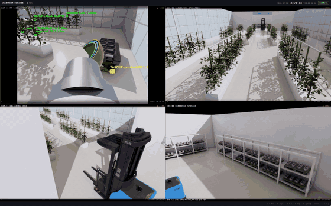
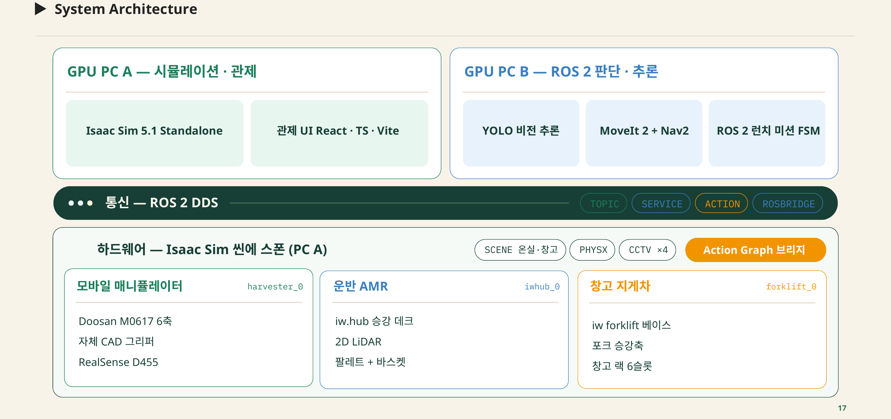
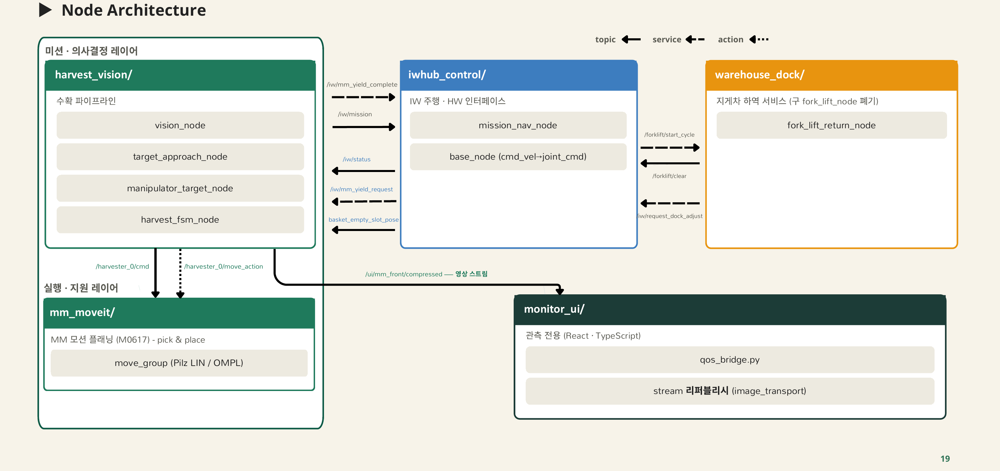
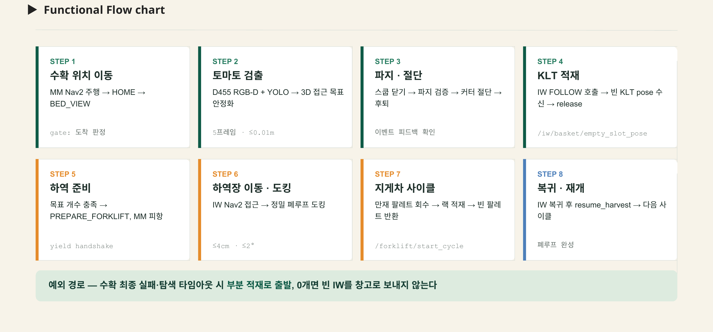
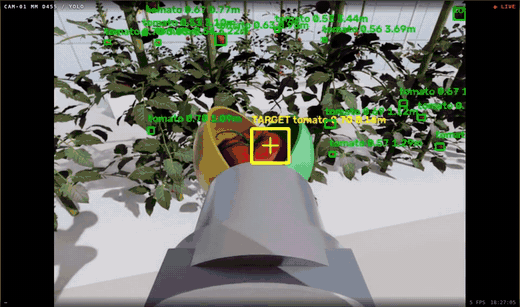
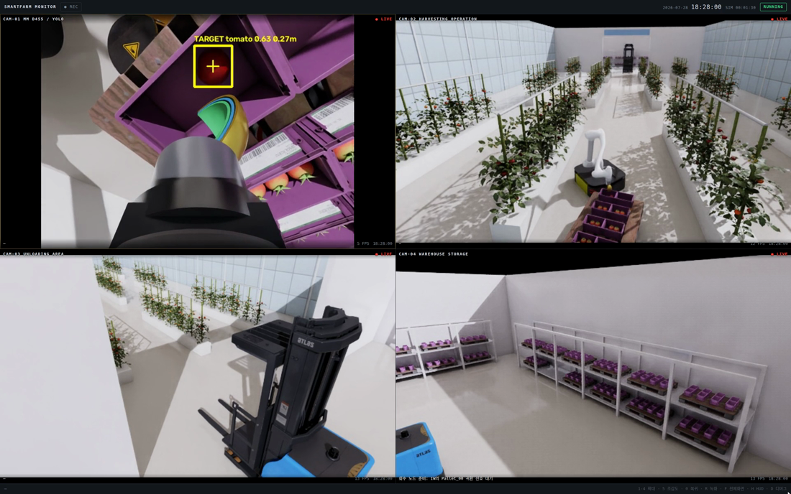

# Smart Farm Autonomous Harvest & Transport System (Isaac Sim + ROS 2 + Nav2 + MoveIt 2 + YOLO)

이 프로젝트는 **ROS 2 Humble**과 **NVIDIA Isaac Sim 5.1** 환경에서 구동되는 스마트팜 수확·운반 자동화 시스템입니다.
**수확 MM · 운반 AMR(iw.hub) · 창고 지게차** 로봇 3대가 한 사이클을 나눠 맡아,
**토마토 검출 → 파지·절단 → IW 데크 KLT 적재 → 운반 → 정밀 도킹 → 창고 랙 적재 → 빈 팔레트 반환**까지를
하나의 ROS 2 파이프라인으로 자동 수행합니다.

설계 원칙은 **판단은 ROS 2, 실행은 Isaac Sim**입니다. 의사결정 FSM과 경로·모션 계획은 모두 ROS 2 노드에 있고,
Isaac Sim은 물리(PhysX)·센서·액추에이터만 담당합니다.



*4분할 관제 화면으로 본 한 사이클(1분 원본 5배속). 좌상 CAM-01 = MM 손끝 D455 + YOLO, 우상 CAM-02 = 수확 구간, 좌하 CAM-03 = 인계 구역, 우하 CAM-04 = 창고 랙.*

## 기술 문서

- [로봇 모델·MoveIt·Nav2 구성 및 튜닝 가이드](docs/robot_model_moveit_nav2_tuning_guide.md): 모델 조립, 실제 파라미터와 근거, 프레임워크와 프로젝트 코드의 책임 경계
- [MM 시스템 가이드](docs/mm_system_guide.md): 비전·수확·플레이스·피항 전체 흐름
- [IW 시스템 가이드](docs/iw_system_guide.md): MM 추종·레인 주행·정밀 도킹·Forklift 연동
- [Forklift 시스템 가이드](docs/forklift_system_guide.md): 팔레트 인계와 랙 운용

---

## 주요 기능 (Key Features)

### 1. 토마토 인식 및 3D 목표 생성 (Vision)

- **탐지:** Ultralytics YOLO 파인튜닝 모델(`finetuned_far.pt`)로 RGB 프레임에서 토마토 bbox를 검출합니다. (conf 0.45)
- **거리 추정:** bbox 중심 영역의 **median depth**를 사용합니다. 단일 픽셀 depth는 잎 가림·노이즈에 취약해 중앙값으로 대표값을 잡습니다.
- **3D 변환:** `CameraInfo`의 `fx, fy, cx, cy`로 픽셀 + depth를 카메라 광학 좌표계 3D 점으로 역투영합니다.
- **안전 게이트:** 도달 불가 목표(workspace gate)는 모션 계획 **전에** 차단하고, 필요하면 베이스 재배치를 요청합니다.
- **파지 좌표 보정:** 검출로 잡은 접근 목표에 Isaac이 발행하는 `/harvester_0/sim/tomato`를 더해 최종 파지 좌표를 확정합니다 (`use_sim_ground_truth`, `direct_sim_grasp`).
- **품질 판정:** 근거리 `ripe`/`spoiled` 2클래스 모델(`finetuned_near.pt`)은 `use_quality_model:=true`로 켭니다.

### 2. 3단 스쿱 파지 및 절단 (Manipulation)

- **구조:** 안쪽 2단 셸이 과실을 **형상으로 수용**하고, 바깥 3단 날이 꽃자루를 절단합니다. 2지 그리퍼의 점 접촉 파지에서 발생하던 미끄러짐·튕김 실패 모드를 구조 변경으로 제거했습니다.
- **접근:** 원거리 구간은 **OMPL RRTConnect**로 충돌을 회피하고, 최종 진입·후퇴는 **Pilz LIN**으로 TCP 직선 경로를 보장합니다.
- **IK 선택:** 여러 seed IK 해 중 **관절 변화가 작고 충돌 없는 해**를 고릅니다(단일 관절 변화 상한 120°).
- **미세 보정:** 수용 직전 `CAPTURE_TRIM` 단계에서 최신 과실 위치를 반영해 **저속 LIN**(velocity_scale 0.0455)으로 보정합니다.
- **절단 판정:** 블레이드 각도 **40° 이상**을 절단 완료로 판정하고, 파지 검증 후 후퇴합니다.

### 3. 로봇별 항법 전략 분리 (Navigation)

- **MM (AMR):** `NavigateToPose`로 수확 자세까지 이동합니다. **Rotation Shim → DWB** 조합으로 방향을 먼저 맞춘 뒤 경로를 추종하고, 목표 허용오차는 0.15 m / 0.35 rad입니다.
- **IW (AMR):** 통로 중심선 **레인 그래프** 위 웨이포인트를 `NavigateThroughPoses`로 통과합니다. 경로가 레인 위에 있으면 재배 베드와의 이격이 설계상 보장됩니다. MM 추종 목표는 0.30 m 이동 또는 30° 변화 시에만 갱신합니다(deadband).
- **Forklift (AGV적 운용):** 경로가 고정된 창고 내부라 **Nav2를 쓰지 않고** 웨이포인트 Step FSM으로 제어합니다. Ackermann형 후륜 조향이라 제자리 회전이 불가능합니다.

### 4. 정밀 도킹 및 팔레트 교환 (Docking & Logistics)

- **폐루프 도킹:** Nav2 도착 후 `POSITION → YAW → SETTLE` 3단계 폐루프로 정렬합니다. 완료 조건은 **위치 ≤ 4 cm · 각도 ≤ 2° · 1 s 안정**이며, 타임아웃 45 s입니다.
- **팔레트 사이클:** 지게차가 만재 팔레트를 IW에서 회수해 원래 랙 슬롯(3섹터 × 2단 = 6슬롯)에 복귀시키고, 다음 빈 팔레트를 꺼내 IW에 상차합니다.
- **재정렬 요청:** 포크 정렬에 실패하면 지게차가 서비스로 IW 재정렬을 요청합니다(최대 3회).

### 5. 로봇 간 명시적 인계 (ROS 2 Handshake)

- **미션 전달:** `/iw/mission` 토픽으로 `IDLE` / `FOLLOW` / `PREPARE_FORKLIFT` / `FORKLIFT` 상태를 전달합니다.
- **피항 handshake:** IW가 출발하기 전 `/iw/mm_yield_request`로 MM에게 통로 양보를 요청하고, MM이 `/iw/mm_yield_complete`로 응답한 뒤 이동합니다.
- **장시간 작업 분리:** 지게차 사이클은 서비스(`/forklift/start_cycle`)로 **접수**만 응답하고, 실제 완료는 `/forklift/clear` 토픽으로 통지합니다.

### 6. 관제 UI 및 기록 (Monitoring)

- **4분할 CCTV 화면:** React + TypeScript 클라이언트가 MJPEG 영상(8080)과 상태 JSON(9090 rosbridge, 5 Hz)을 받아 표시합니다.
- **기록:** `R` 키로 MCAP 포맷 rosbag 녹화를 시작·정지하며, 실패 케이스를 재생해 분석합니다.

---

## 시스템 설계 (System Architecture)

### 전체 구조

시스템은 크게 **Perception(인식)**, **Decision(판단)**, **Control(제어)**, **Monitoring(관측)** 네 파트로 구성됩니다.

1. **Perception:** Isaac Sim의 eye-in-hand RealSense D455(RGB-D)와 2D LiDAR 데이터를 받아, `vision_node`가 YOLO로 토마토를 식별하고 `CameraInfo` 역투영으로 3D 접근 목표를 만듭니다.
2. **Decision:** `fixed_harvest_moveit_node`(상위 코디네이터)가 Nav2 도착·팔 자세·적재 수를 종합해 다음 단계를 결정하고, `manipulator_target_node`가 파지·절단·플레이스 24개 상태의 상세 FSM을 돌립니다. IW는 `mission_nav_node`, 지게차는 `fork_lift_return_node`가 각자의 FSM을 담당합니다.
3. **Control:** MoveIt 2 `move_group`(OMPL / Pilz)과 Nav2(DWB / AMCL)가 궤적을 만들고, `topic_based_ros2_control`과 OmniGraph 브리지를 거쳐 Isaac Sim의 조인트로 전달됩니다.
4. **Monitoring:** `ui_status_node`가 로봇 상태·카메라 Hz·수확 집계·도매시세를 `/ui/status` 하나로 평탄화해 5 Hz JSON으로 발행합니다. 프론트가 토픽 열댓 개를 각각 구독하고 커스텀 메시지를 TypeScript로 재정의하는 비용을 없애는 게 목적입니다. 영상은 대역폭 때문에 이 채널에 싣지 않고 MJPEG(8080)로 분리합니다.

### 노드 구성

| 패키지 | 노드 | 파트 | 역할 |
|---|---|---|---|
| `harvest_vision` | `vision_node` | Perception | YOLO 검출 → 3D 접근 목표 발행 |
| | `vision_debug_view` | Perception | 검출 오버레이 디버그 창 (`use_debug:=true`) |
| | `manipulator_target_node` | Decision | 파지·절단·플레이스 상세 FSM |
| | `fixed_harvest_moveit_node` | Decision | 상위 코디네이터 (Nav2 게이트·적재 카운트·IW 미션·MM 피항) |
| `mm_moveit` | `mm_motion_bridge` | Control | JSON 명령 → MoveGroup goal, Ranked IK·파이프라인 선택 |
| | `move_group` | Control | MoveIt 2 모션 계획 (OMPL / Pilz) |
| | `servo_node` | Control | MoveIt Servo 실시간 지령 경로 (`config/servo.yaml`) |
| `fleet_dispatch` | `cmd_vel_watchdog` | Control | Nav2 중단 시 마지막 속도 유지 방지 |
| | `nav2_lifecycle_activator` | Control | Nav2 lifecycle 노드 일괄 활성화 |
| `iwhub_control` | `mission_nav_node` | Decision | IW 미션 FSM + 정밀 도킹 폐루프 |
| | `base_node` | Control | `/cmd_vel` → 좌·우 바퀴 `joint_command` |
| | `scan_self_filter_node` | Perception | 적재 팔레트·KLT를 자기 라이다에서 제거 |
| `warehouse_dock` | `fork_lift_return_node` | Decision | 팔레트 회수·랙 적재·빈 팔레트 반환 Step FSM |
| `monitor_ui` | `ui_status_node` | Monitoring | 로봇·카메라 Hz·수확·시세를 `/ui/status` 5 Hz JSON으로 평탄화 |
| | `qos_bridge` ×5 | Monitoring | BEST_EFFORT 센서 영상 → RELIABLE `republish` 입력으로 변환 |
| | `market_price_node` | Monitoring | 공공데이터 온라인 도매시장 시세 → `/market/summary` |
| | `recorder_node` | Monitoring | MCAP rosbag 녹화 시작·정지 |

### 아키텍처 다이어그램



**GPU PC A(시뮬레이션·관제)**와 **GPU PC B(ROS 2 판단·추론)** 두 대를 동일 ROS 2 DDS로 직접 연결합니다.
PC A는 Isaac Sim 5.1 Standalone과 관제 UI(React · TS · Vite)를, PC B는 YOLO 비전 추론 · MoveIt 2 + Nav2 · 미션 FSM을 맡습니다.
로봇 3대(`harvester_0` / `iwhub_0` / `forklift_0`)와 온실·창고 씬, CCTV 4대는 모두 PC A의 Isaac Sim 씬에 스폰되고 **Action Graph 브리지**로 토픽을 주고받습니다.



패키지별 노드와 토픽 / 서비스 / 액션 연결입니다. 실선 = Topic, 파선 = Service, 점선 = Action.

---

## 알고리즘 플로우 차트 (Logic Flow)



수확 위치 이동 → 토마토 검출 → 파지·절단 → KLT 적재 → 하역 준비 → 하역장 이동·도킹
→ 지게차 사이클 → 복귀·재개의 8단계 폐루프.

**예외 경로** — 수확 최종 실패·탐색 타임아웃 시 부분 적재로 출발하고, 적재 0개면 빈 IW를 창고로 보내지 않는다.

---

## 개발 환경 (Environment)

<p align="center">
  
  
  
  
  
</p>

| 항목 | 값 |
|---|---|
| **OS** | Ubuntu 22.04.5 LTS (Jammy Jellyfish) |
| **Middleware** | ROS 2 Humble Hawksbill (`/opt/ros/humble`) |
| **Simulator** | NVIDIA Isaac Sim 5.1 (Standalone, PhysX) |
| **Language** | Python 3.10 (ROS 2 노드) / Python 3.11 (Isaac Sim 동봉 인터프리터) |
| **Key Libraries** | `rclpy`, `ultralytics`, `cv_bridge`, `moveit_ros_move_group`, `nav2_bringup`, `topic_based_ros2_control`, `web_video_server`, `rosbridge_server` |
| **Frontend** | React 18 + TypeScript 5 + Vite 6 + roslib |
| **통신 설정** | `ROS_DOMAIN_ID=108` · `RMW_IMPLEMENTATION=rmw_fastrtps_cpp` · `use_sim_time=true` |

> `isaacpjt/main.py`가 `ROS_DOMAIN_ID`를 **108로 강제**합니다. ROS 터미널도 108이어야 통신됩니다.
> Isaac Sim 코드는 반드시 Isaac 동봉 `python.sh`(Python 3.11)로 실행해야 하며 시스템 python으로는 동작하지 않습니다.

---

## 사용 장비 (Hardware Setup)

**PC:** MSI Vector 16 HX AI · CPU 인텔 Core Ultra 9 275HX (24스레드) · GPU NVIDIA GeForce RTX 5080 Laptop (16GB GDDR7) · RAM 64GB

본 프로젝트는 **NVIDIA Isaac Sim** 위에 구성한 로봇 3대를 기준으로 개발되었습니다.

| Robot | Component | Type | Topic / Spec |
|---|---|---|---|
| **MM** (`harvester_0`) | Base | Ridgeback (가상 홀로노믹 x/y/yaw 구동) | `/harvester_0/cmd` (JSON) |
| | Manipulator | Doosan **M0617** 6축 | `/harvester_0/joint_command`, `/harvester_0/joint_states` |
| | End Effector | 3단 동축 스쿱 (수용 2단 + 절단 날 1단) | `/harvester_0/cmd` (`gripper`, `blade`) |
| | Vision | RealSense **D455** (eye-in-hand RGB-D) | `/harvester_0/rgb`, `/harvester_0/depth`, `/harvester_0/camera_info` |
| **IW** (`iwhub_0`) | Base | iw.hub 차동구동 AMR + 승강 데크 | `/iwhub_0/cmd_vel`, `/iwhub_0/odom` |
| | Lidar | 2D LiDAR (전·후방) | `/iwhub_0/scan` |
| | Payload | EUR 팔레트 + KLT 박스 (전면 2칸이 MM 플레이스 전용) | `/iw/basket/empty_slot_pose` |
| **Forklift** (`forklift_0`) | Base | ForkliftB — 후륜 구동·조향 (wheelbase 2.05 m, 조향 ±70°) | `/forklift_0/joint_command` |
| | Fork | prismatic 1축 승강 (0 ~ 2.0 m) | `/forklift_0/joint_command` |
| | Pose | Isaac 직접 발행 | `/forklift_0/pose` |
| **환경** | CCTV | 고정 감시 카메라 4대 (`--cctv`) | `/cctv/greenhouse`, `/cctv/unloading`, `/cctv/storage`, `/cctv/overview` |
| | Map | Nav2 정적맵 | `maps/farm.yaml` |
| | Rack | 창고 랙 3섹터 × 2단 = 6슬롯 | — |



*CAM-01(MM 손끝 D455). YOLO 검출 오버레이와 3단 스쿱이 IW 데크의 KLT에 과실을 놓는 구간.*

---

## 의존성 설치 (Installation)

### 1. Python 필수 라이브러리 (`requirements.txt`)

YOLO 구동 및 이미지 처리를 위한 패키지입니다.

```bash
pip install -r requirements.txt
```

`numpy`는 반드시 **1.x**여야 합니다 — `cv_bridge`와 Isaac 확장 모듈이 1.x ABI로 빌드돼 있어
2.x로 올리면 import가 깨집니다. `torch`는 GPU에 맞는 CUDA 빌드로 별도 설치하며,
RTX 50 계열은 **cu128 이상**이 필요합니다.

시연용 YOLO 가중치는 `src/smartfarm/harvest_vision/resource/`에 포함되어 있어 별도 내려받기가
필요 없습니다. 다만 원본 학습 데이터셋과 도메인 적응 스크립트는 이 저장소에 없어,
저장소만으로 재학습을 재현할 수는 없습니다.

### 2. 서브모듈 및 웹 의존성

서브모듈은 **`rosdep`보다 먼저** 받아야 합니다. `fleet_dispatch`가 `explore_lite`(자동 탐사 맵핑)를
의존성으로 걸고 있는데 apt 배포판이 없어 서브모듈로 들어있습니다. 소스 트리에 없는 상태로
`rosdep install`을 돌리면 `Cannot locate rosdep definition for [explore_lite]`로 실패합니다.

```bash
# 외부 ROS 2 서브모듈 (m-explore-ros2)
cd ~/cobot3_ws
git submodule update --init --recursive

# 관제 UI 웹 (Node 18 이상)
cd ~/cobot3_ws/src/smartfarm/monitor_ui/web && npm install
```

### 3. ROS 2 패키지 설치

MoveIt 2, Nav2, ros2_control 및 관제 UI 관련 패키지가 설치되어 있어야 합니다.

```bash
source /opt/ros/humble/setup.bash
sudo apt update

# MoveIt 2 / ros2_control / 주행
sudo apt install -y \
  ros-humble-moveit ros-humble-moveit-servo \
  ros-humble-moveit-planners-chomp \
  ros-humble-moveit-task-constructor-core \
  ros-humble-moveit-task-constructor-capabilities \
  ros-humble-ros2-control ros-humble-ros2-controllers \
  ros-humble-ur-description ros-humble-ur-moveit-config \
  ros-humble-navigation2 ros-humble-nav2-bringup \
  ros-humble-nav2-smac-planner \
  ros-humble-nav2-regulated-pure-pursuit-controller \
  ros-humble-slam-toolbox

# Isaac ↔ MoveIt 하드웨어 인터페이스
sudo apt install -y ros-humble-topic-based-ros2-control

# 관제 UI 전용
sudo apt install -y \
  ros-humble-web-video-server ros-humble-image-transport \
  ros-humble-compressed-image-transport \
  ros-humble-rosbridge-server ros-humble-rosbag2-storage-mcap
```

목록을 외우는 대신 `package.xml`에서 뽑아 쓰는 쪽이 안전합니다. `rosdep`을 처음 쓰는
머신이면 초기화가 먼저 필요합니다.

```bash
sudo rosdep init     # 처음 한 번만. 이미 했으면 "already exists" 경고가 뜨며 무시해도 됩니다
rosdep update

cd ~/cobot3_ws
rosdep install --from-paths src --ignore-src -r -y --rosdistro humble
```

### 4. 빌드

```bash
cd ~/cobot3_ws
rm -rf build install log
source /opt/ros/humble/setup.bash
colcon build --symlink-install
source install/setup.bash
```

> `colcon build`가 `smartfarm_interfaces`에서 `ModuleNotFoundError: No module named 'em'` /
> `'catkin_pkg'`로 실패하면 `./scripts/fix_ros_build_env.sh`를 실행합니다.
> `$ROS_DISTRO`를 감지해 맞는 `empy` 버전을 설치합니다(수동 `pip install empy`만 하면 안 됩니다).

---

## 실행 순서 (How to Run)

전체 시스템을 구동하기 위해 아래 순서대로 터미널을 실행하세요.
**Isaac Sim이 먼저 떠 있어야** 나머지 노드가 붙습니다.

모든 ROS 터미널은 아래 준비가 되어 있어야 합니다.

```bash
cd ~/cobot3_ws
source /opt/ros/humble/setup.bash
source install/setup.bash
export ROS_DOMAIN_ID=108
export RMW_IMPLEMENTATION=rmw_fastrtps_cpp
```

### 1. Isaac Sim 실행 (Simulation)

온실·창고 씬을 띄우고 로봇 3대를 스폰합니다. ROS 2 브리지(OmniGraph)가 함께 활성화됩니다.

```bash
# 터미널 1
cd ~/cobot3_ws/isaacpjt
isaac_python main.py --mm --iw --fork --nav --cctv
```

- `isaac_python`은 Isaac Sim 동봉 `python.sh`의 alias입니다
  (`~/dev_ws/isaac_sim/isaacsim/_build/linux-x86_64/release/python.sh`).
- 이 터미널은 `source` 불필요 — `main.py`가 Isaac 내장 ROS 2 환경으로 스스로 재실행합니다.

| 플래그 | 의미 |
|---|---|
| `--mm` / `--iw` / `--fork` | 각 로봇 스폰 (조합 가능) |
| `--nav` | Nav2용 `cmd_vel`·`odom`·`scan` 브리지 일괄 활성화 |
| `--cctv` | 관제 UI용 고정 감시 카메라 4대 (UI를 쓸 때 필수) |
| `--no-camera` | 손끝 D455를 끕니다 (기본은 켜짐) |
| `--headless` / `--no-ros` | GUI 없이 / ROS 브리지 없이 실행 |

**정상 확인**

```bash
ros2 topic echo /clock --once
ros2 topic list | grep -E "harvester_0|iwhub_0|forklift_0|cctv"
```

### 2. MM 실행 (Nav2 + MoveIt + Vision + 수확 FSM)

MM의 Nav2, MoveIt 2, 비전 파이프라인, 수확 코디네이터가 한 번에 뜹니다.

```bash
# 터미널 2
ros2 launch smartfarm_bringup mm.launch.py
```

| 인자 | 기본값 | 의미 |
|---|---|---|
| `harvest_x` / `harvest_y` / `harvest_yaw` | `-0.54` / `-8.19` / `1.91` | MM이 정차해 수확할 map 자세 |
| `initial_pose_x` / `initial_pose_y` | `0.0` / `-12.0` | AMCL 초기 pose |
| `place_target_count` | `1` | IW 하역 전 수확·적재할 토마토 개수 |
| `map` | `~/cobot3_ws/maps/farm.yaml` | Nav2 정적맵 |
| `nav_rviz` / `moveit_rviz` / `use_debug` | `true` | RViz 2종 · 비전 디버그 창 |

```bash
# 2회 수확 후 하역 (IW 데크 앞열 빈 KLT가 2칸이라 최대 2까지 의미가 있습니다)
ros2 launch smartfarm_bringup mm.launch.py place_target_count:=2
```

**정상 확인**

```bash
ros2 topic echo /harvester_0/moveit_ready --once     # data: true
ros2 topic echo /harvest_test/status --once          # READY_FOR_NAV_GOAL → NAVIGATING…
ros2 topic hz   /harvester_0/vision/tomato_detections
```

### 3. IW 실행 (운반 AMR)

IW 전용 Nav2와 미션·도킹 노드를 띄웁니다.

```bash
# 터미널 3
ros2 launch smartfarm_bringup iw.launch.py
```

| 인자 | 기본값 | 의미 |
|---|---|---|
| `iw_dock_standoff` | `1.03` | MM 중심에서 IW 추종 정차점까지 이격 거리 (m) |
| `iw_rviz` | `true` | IW 전용 RViz |

**정상 확인**

```bash
ros2 topic echo /iw/status --once                    # IDLE
ros2 action list | grep navigate_through_poses
```

### 4. Forklift 실행 (창고 하역)

팔레트 회수·랙 적재·빈 팔레트 반환 사이클 노드를 띄웁니다.

```bash
# 터미널 4
ros2 launch smartfarm_bringup forklift.launch.py
```

**정상 확인**

```bash
ros2 service list | grep /forklift/start_cycle
ros2 topic echo /forklift/status --once
```

### 5. 관제 UI 실행 (선택)

영상 스트리밍(:8080), rosbridge(:9090), 상태 집계, 녹화 제어가 한 번에 뜹니다.
Isaac을 **`--cctv`와 함께** 띄워야 고정 카메라 4대가 나옵니다.

```bash
# 터미널 5 — ROS 쪽
ros2 launch monitor_ui ui.launch.py

# 터미널 6 — 웹 화면
cd ~/cobot3_ws/src/smartfarm/monitor_ui/web && npm run dev
```

브라우저에서 <http://localhost:5173> 접속.

| 키 | 동작 |
|---|---|
| `1` ~ `4` | 해당 카메라 확대 (더블클릭 동일) |
| `5` | 전체 조감도 CAM-05 |
| `0` / `ESC` | 2×2 복귀 |
| `R` | rosbag 녹화 시작·정지 (MCAP) |
| `H` / `D` | HUD 숨김 / 디버그 정보 |

> `ui.launch.py`가 `stream.launch.py`를 포함합니다. 둘을 같이 띄우면 영상 노드가 이중으로 뜹니다.


